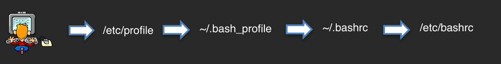
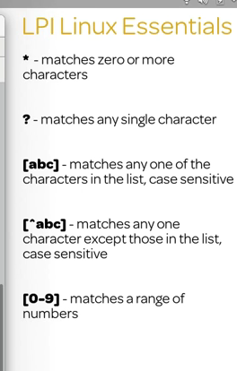

# Linux Administration

A Linux Distribution is comprised of

1. Linux Kernel

2. Core Util: Bash, File System etc

3. Supplemental Software: Games, Office, Apps

4. System Services: Networking services, Logging, Security services -- Mostly used systemd

5. Software management: How software is installed unisntalled updated etc

Most Common Distributions

1. Slackware: Compile any software you need to install

2. Debian: Stable release

3. Red Hat Enterprise Linux: Used for Data Servers

4. SUSE

5. Ubuntu: Simple install, good for new users, based on Debian

6. Fedora: Owned by Red Hat but open source

7. openSUSE: Suse but Open

8. CentOS: Rebuilt of Redhat for Data Server. No Support of Red Hat. But large open community

# Sources

Linux Essentials
https://linuxacademy.com/cp/modules/view/id/161


Bash Scripting
https://linuxacademy.com/cp/modules/view/id/72

Linux Red hat System Admin
https://linuxacademy.com/cp/modules/view/id/39


# Commands


* `la -a` (to show all files/directories) . is hidden

* `ls -l` (all details)d = directory - = file

* to sort by size use `S` we use `ls -Sla` (we can group flags together without space)

* To show which file got modified latest`ls -lt`

* `whoami = echo $LOGNAME`

* To change user `su <user>` and To just login to root `su -`

* To reboot system `reboot = init 6`

* To halt or shutdown `halt = poweroff = init 0 = shutdown -h`

* Top running process on linux `top =   {Topas in AIX}` h for more commands

## uname command

* uname

* release version `uname -r`

* build version `uname -v`

* kernal version `uname -m`

* Usage: `uname [-snlrvmaxupfFMWS:T:L]`

* print working directory `pwd = echo $PWD`

* To go to home directory from anywhere just type `cd` and if you want to go back to the previous directory `cd -`

* to execute history command with all the numbers `history` then just enter the `!num` to get the command

## Login Scripts Execution

When we log in shell following occurs
1. first /etc/profile gets executed
2. files are searched in following order
	1. ~/bash_pofile
	2. ~/bash_login
	3. ~/.profile
3. Next, ~/.basrc
4. Usually bashrc calls /etc/bashrc
5. ~/bash_logout gets executed when the user logs out




To send an email of all the commands used when we log out

* create a file ~./bash_logout in that put this command
* 
```shell
history | tail -20 | mailx -s "log `hostname` pada `date`" asyed@nshe.nevada.edu
```

## Bash Regular Expression



https://www.rexegg.com/regex-quickstart.html

