# Linux Administration

A Linux Distribution is comprised of

1. Linux Kernel

2. Core Util: Bash, File System etc

3. Supplemental Software: Games, Office, Apps

4. System Services: Networking services, Logging, Security services -- Mostly used systemd

5. Software management: How software is installed unisntalled updated etc

Most Common Distributions

1. Slackware: Compile any software you need to install

2. Debian: Stable release

3. Red Hat Enterprise Linux: Used for Data Servers

4. SUSE

5. Ubuntu: Simple install, good for new users, based on Debian

6. Fedora: Owned by Red Hat but open source

7. openSUSE: Suse but Open

8. CentOS: Rebuilt of Redhat for Data Server. No Support of Red Hat. But large open community

# Sources

Linux Essentials
https://linuxacademy.com/cp/modules/view/id/161


Bash Scripting
https://linuxacademy.com/cp/modules/view/id/72

Linux Red hat System Admin
https://linuxacademy.com/cp/modules/view/id/39

Linux Full CI/CD Pipeline
https://linuxacademy.com/cp/courses/lesson/course/2196/lesson/2/module/218

Virtualization Course
https://linuxacademy.com/cp/modules/view/id/211

OpenSource Admin
https://linuxacademy.com/cp/modules/view/id/194


# Commands


* `la -a` (to show all files/directories) . is hidden

* `ls -l` (all details)d = directory - = file

* to sort by size use `S` we use `ls -Sla` (we can group flags together without space)

* To show which file got modified latest`ls -lt`

* `whoami = echo $LOGNAME`

* To change user `su <user>` and To just login to root `su -`

* To reboot system `reboot = init 6`

* To halt or shutdown `halt = poweroff = init 0 = shutdown -h`

* Top running process on linux `top =   {Topas in AIX}` h for more commands

## uname command

* uname

* release version `uname -r`

* build version `uname -v`

* kernal version `uname -m`

* Usage: `uname [-snlrvmaxupfFMWS:T:L]`

* print working directory `pwd = echo $PWD`

* To go to home directory from anywhere just type `cd` and if you want to go back to the previous directory `cd -`

* to execute history command with all the numbers `history` then just enter the `!num` to get the command

## Login Scripts Execution

When we log in shell following occurs
1. first /etc/profile gets executed
2. files are searched in following order
	1. ~/bash_pofile
	2. ~/bash_login
	3. ~/.profile
3. Next, ~/.basrc
4. Usually bashrc calls /etc/bashrc
5. ~/bash_logout gets executed when the user logs out


To send an email of all the commands used when we log out

* create a file ~./bash_logout in that put this command
* 
```shell
history | tail -20 | mailx -s "log `hostname` pada `date`" asyed@nshe.nevada.edu
```

## Bash Regular Expression


https://www.rexegg.com/regex-quickstart.html


# Quoting

The double quotes will give the value where as single quotes will retain the string

```shell
>echo "The user is $LOGNAME"
The user is psftadm
>echo 'The user is $LOGNAME'
The user is $LOGNAME

```

If we want to access a folder which has space then we can use both single or double quote or backslash as an escape

to enter single command in multiple lines use backslash `\` and press enter to start a new line


# Locate, Find and Whereis

locate xyz searches for xyz in all directories and sub directories. This is not in AIX

find does recursive search

`find <full path mandatory> -name '*.xyz'`

# man


how to use: `man ls`


```shell
man -k gre # Gives all the command which has gre in it. The number in brackets are sections pages
LAPI_Msgpoll(3) - Allows the calling thread to check communication progress.
LAPI_Probe(3)   - Transfers control to the communication subsystem to check for arrivingmessages and to make progress in polling mode.
agg_arm_stat(3) - Aggregate advanced accounting data.
agg_lpar_stat(3)        - Aggregate advanced accounting data.
agg_proc_stat(3)        - Aggregate advanced accounting data.
arm_update(3)   - The arm_update subroutine is used to collect informationabout a transaction's progress.
arm_update2(3)  - The arm_update subroutine is used to collect informationabout a transaction's progress.
arm_update_Dual_Call(3) - The arm_update subroutine is used to collect informationabout a transaction's progress.
color_content(3)        - Returns the current intensity of the red, green, andblue (RGB) components  of a color.
egrep(1)        - Searches a file for a pattern.
endgrent(3)     - Accesses the basic group information in the user database.
endnetgrent(3)  - Handles the group network entries.
endnetgrent_r(3)        - Handles the group network entries.
fgrep(1)        - Searches a file for a literal string.
free_agg_list(3)        - Aggregate advanced accounting data.
getgrent(3)     - Accesses the basic group information in the user database.
getnetgrent(3)  - Handles the group network entries.
getnetgrent_r(3)        - Handles the group network entries.
greek(1)        - Converts English-language output from a Teletype Model37 workstation to output for other workstations.
grep(1) - Searches for a pattern in a file.
inulag(1)       - Acts as the front end to the subroutines to manage license agreements.
isgreater(3)    - Tests if x is greater than y.
isgreaterequal(3)       - Tests if x is greater than or equal to y.
islessgreater(3)        - Tests if x is less than or greater than y.
nisgrep(1)      - Utility for searching NIS+ tables.
putgrent(3)     - Updates group descriptions.
setgrent(3)     - Accesses the basic group information in the user database.
setnetgrent(3)  - Handles the group network entries.
setnetgrent_r(3)        - Handles the group network entries.
sigrelse(3)     - Enhance the signal facility and provide  signal management.
socks5tcp_bind(3)       - Connect to a SOCKSv5 server and request a listening socket for incomingremote connections.

```

in man to search, use `/` for forward search and `?` for backward search and `n` to go to next search


# THE LINUX FILE SYSTEM

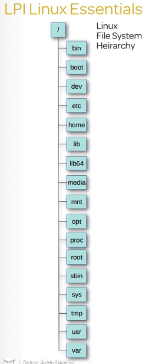

The hardrives are located in `/dev` For the first directory it will be `/dev/sda` and second will be `/dev/sdb` and so no. The first partition in the first drive will be `/dev/sda1` and so on

result for `df -g`

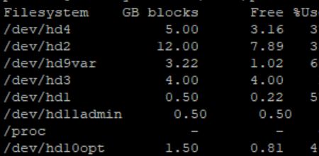


# FILES AND DIRECTORIES

```shell
[user@ museum]$ mkdir documents maps art
[user@ museum]$ ls
art  documents  maps
[user@ museum]$ mkdir -p art/paintings/modern # To create recursive directory at the same time
[user@ museum]$ ls -R art # Recursive ls
art:
paintings
art/paintings:
modern
art/paintings/modern:
[user@ museum]$ rmdir statues # to remove empty directory, else use rm -r
[user@ museum]$ ls
art  documents  maps
[user@ museum]$ cd documents
[user@ documents]$ touch ancient.txt # to create a file
[user@ documents]$ ls
ancient.txt
[user@ museum]$ cp documents/ancient.txt maps # to copy, to copy recursive use -R
[user@ museum]$ ls maps
ancient.txt
[user@ museum]$ mv maps documents # move command, also used for rename
[user@ museum]$ ls
art  documents
```

# Archiving Files on the Command Line

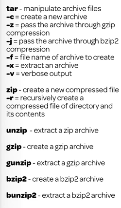

```bash
[user@ museum]$ tar -cf documents.tar documents
[user@ museum]$ ls
art.bak  documents  documents.tar
[user@ museum]$ tar -czf documents.gz documents
[user@ museum]$ ls
art.bak  documents  documents.gz  documents.tar
[user@ museum]$ tar -cjf documents.bz2 documents
[user@ museum]$ ls
art.bak  documents  documents.bz2  documents.gz  documents.tar
[user@ museum]$ rm -r documents
[user@ museum]$ ls
art.bak  documents.bz2  documents.gz  documents.tar
[user@ museum]$ tar -xzf documents.gz
[user@ museum]$ ls
art.bak  documents  documents.bz2  documents.gz  documents.tar
[user@ museum]$ ls -R documents
documents:
ancient.txt  maps
documents/maps:
ancient.txt
[user@ museum]$ rm -rf documents
[user@ museum]$ tar -xvjf documents.bz2
documents/
documents/ancient.txt
documents/maps/
documents/maps/ancient.txt
```

# Vieweing Text


`tail -fn0 logfile`   for single line

# Analyzing Text


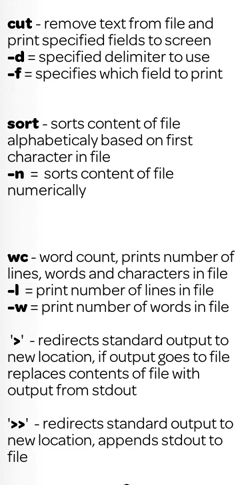

`>` to send output to destination and `>>` to append ouput to the destination instead of replacing old data

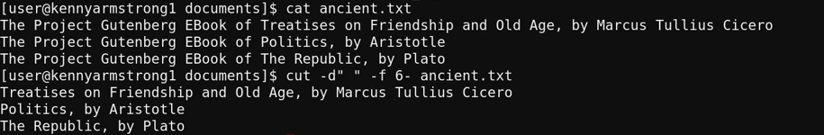


## Pipes and Regular Expressions

grep

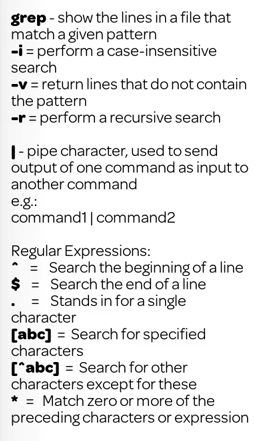

`grep -i 'error' xyz.log | wc -w`

To start with a string x

`grep -i '^error' xyz.log`

print lines that end with string

`grep -i 'error$' xyz.log`

cut a command and get a section out

`grep 'error' xyz.log | cut -d" " -f2` This command will print the error line and cut it into section based on space and then print the section section. So if the line was `error logfile23` it will print `logfile23` and if instead of `-f2` it was `-f1` it would print `error`

# Turning Commands into a Script

## nano

Command line text editor

not in AIX

## vi/vim

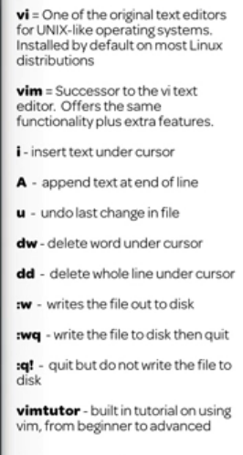

* h = cursor left
* j = cursor down
* k = curson up
* l = cursor right
* to move to top of editor `gg`
* to append text at end of line `shift+a`

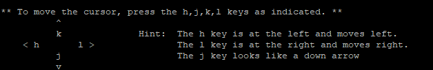

To copy
* go to text press `v`
* using arrow keys select till where you want to copy then press `y`
* To paste press `p`
* to undo press `u`. Only one undo can be performed

`vimtutor` to learn more

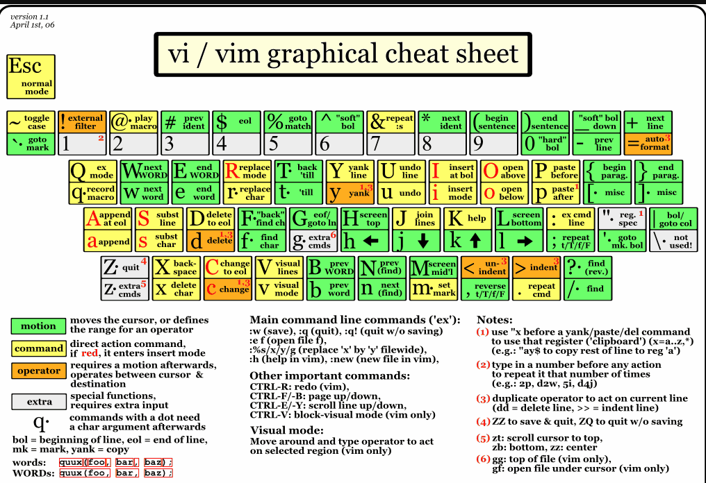

Go to [Link](http://www.worldtimzone.com/res/vi.html) for more details about any key

## Shell Scripting Part 1

a shell script need not end with `.sh` This is just for us to understand.

The shebang is used to tell bash what scripting language is being used `#!/bin/bash` For better portability use `#!/usr/bin/env bash`

A comment line begins with `# comment`

### Permissions

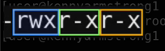

[user][group][other]

to simply add executive permissions to the user do `chmod +x file` and to remove `chmod -x file`

### if-else-fi

```shell

#!/bin/bash

# My daily routine script

# Display the date and time in UTC format
date -u

# Daily greeting
echo "Hello user $LOGNAME"

if [ "$PWD" == "$HOME" ]
then
   echo "You are home"
else
   echo "You are in $PWD"
fi

```
## Shell Scripting Part 2

For Loop

```shell
for i in john mary jak pedro
> do
> echo "$i"
> done
john
mary
jak
pedro
```

For Loop -- Range

```shell
for i in {1..10}
> do
> echo "$i"
> done
1
2
3
4
5
6
7
8
9
10
```
The `$1` is positional argument 1 in shell and `$2` is second argument and so on

When storing a command result in a variable use back quote {`}

```shell
USERNAME=`who -m | cut -d" " -f1`
```
The above will store the user name in the variable `USERNAME`

## Hardware

To get processor information `prtconf`

Memory Usage

`nmon` followed by `m` for total memory

`nmon` followed by `t` followed by `4` for memory per process

## Process

A set of instructions loaded in the memory

`ps` ran by itself will show processes in the current shell

`ps -u user` will show the processes under that user

`ps -e` shows all processes by all users

`ps -ef` will show the above but also the path from where the command is running. This is taken from `/proc` directory

# System Logging

`/var/log` is where all major logs are. You need root access for this. `boot.log` has information when the user logs in. `messages.log` will have information about what is happening. `secure.log` has any IDM change

# Networking

Each computer, Ipad, Phone have a unique number called macnumber/physical address. In Windows you can get this by typing `getmac` in cmd. For linux it is `ifconfig -a` . For AIX it is `netstat -ia`

Each computer connected to a network has an IP(Internet Protocol). This is a Logical Number, that means it changes with the change of network.

Subnetmask(Network Mask) is a collection of IP addresses given to number of devices in a small area. This is done by the router. 

Gateway address is the address of the device which will be used to talk to the Internet. This is similar to IP address but it will be the address of the router.

DNS(Domain Name Server) Translates Domain names of websites to their IP address. These are basically big servers which have a sort of a database which has the IP address and their associated domain name. 

The ISP(Internet service providers) keeps the information of where to send the IP address in their routing tables, which is basically stored in really big servers.

```cmd

Pinging google.com [172.217.11.78] with 32 bytes of data:
Reply from 172.217.11.78: bytes=32 time=39ms TTL=252
Reply from 172.217.11.78: bytes=32 time=39ms TTL=252
Reply from 172.217.11.78: bytes=32 time=41ms TTL=252
Reply from 172.217.11.78: bytes=32 time=3007ms TTL=252

Ping statistics for 172.217.11.78:
    Packets: Sent = 4, Received = 4, Lost = 0 (0% loss),
Approximate round trip times in milli-seconds:
    Minimum = 39ms, Maximum = 3007ms, Average = 781ms
```

Above google is domai name and 172.217.11.78 is an IP address. There is a Name Server which will do this translation. 

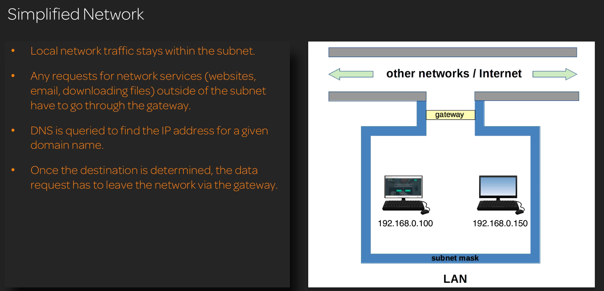

Also note, every system has a local address which can be used by itself only. This is important when we do some testings, like creating a server and using our local system as a server to perform tasks. The local(loopback) IP address always is `127.0.0.1`


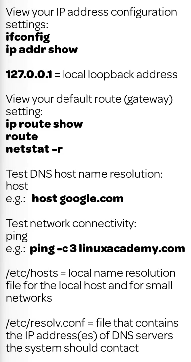

# TODO

# Basic Identity

To see the users logged in `who` and `w` for more details. This will show current users only.

To see the details of the user do `id <usr>`

Three main files that store user information `/etc/passwd` which is primary config file for all users on a system. The `/etc/group` which is primary config file for all groups on system

# Adding Users

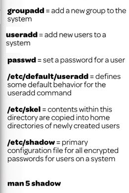

`sudo groupadd <groupName>` then go to `/etc/group` and get the groupID. 

`sudo useradd -G <groupID> -m -c "User Name" <userID>` The -m is for the default home. It is better to use this because all other settings are taken by default. To see what settings are taken do `cat /etc/default/useradd`. In this there will be a `SKEL` command which if we `ls -a /etc/skel` we will see it has all the `.bash_profile` etc. 

To change password `sudo passwd <userID>`

# File and Directory Permission

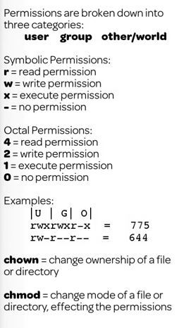

|Symbolic|Octal|
|---|---|
|1|x|
|2|w|
|3|x;w|
|4|r|
|5|r;x|
|6|r;w|
|7|r;w;x|

`chmod -R 775 file.log` = rwxrwxr-x

The key values to remember are

r|w|x
---|---|---|
4|2|1


# Revise above 
# Review AWS Route53
# Security and File Permission