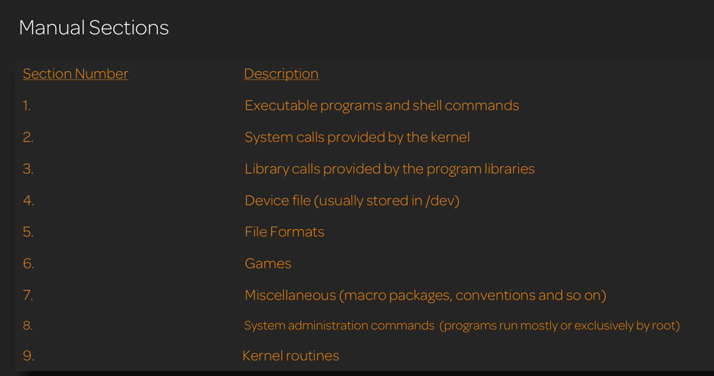

# Linux Administration

A Linux Distribution is comprised of

1. Linux Kernel

2. Core Util: Bash, File System etc

3. Supplemental Software: Games, Office, Apps

4. System Services: Networking services, Logging, Security services -- Mostly used systemd

5. Software management: How software is installed unisntalled updated etc

Most Common Distributions

1. Slackware: Compile any software you need to install

2. Debian: Stable release

3. Red Hat Enterprise Linux: Used for Data Servers

4. SUSE

5. Ubuntu: Simple install, good for new users, based on Debian

6. Fedora: Owned by Red Hat but open source

7. openSUSE: Suse but Open

8. CentOS: Rebuilt of Redhat for Data Server. No Support of Red Hat. But large open community

# Sources

Linux Essentials
https://linuxacademy.com/cp/modules/view/id/161


Bash Scripting
https://linuxacademy.com/cp/modules/view/id/72

Linux Red hat System Admin
https://linuxacademy.com/cp/modules/view/id/39


# Commands


* `la -a` (to show all files/directories) . is hidden

* `ls -l` (all details)d = directory - = file

* to sort by size use `S` we use `ls -Sla` (we can group flags together without space)

* To show which file got modified latest`ls -lt`

* `whoami = echo $LOGNAME`

* To change user `su <user>` and To just login to root `su -`

* To reboot system `reboot = init 6`

* To halt or shutdown `halt = poweroff = init 0 = shutdown -h`

* Top running process on linux `top =   {Topas in AIX}` h for more commands

## uname command

* uname

* release version `uname -r`

* build version `uname -v`

* kernal version `uname -m`

* Usage: `uname [-snlrvmaxupfFMWS:T:L]`

* print working directory `pwd = echo $PWD`

* To go to home directory from anywhere just type `cd` and if you want to go back to the previous directory `cd -`

* to execute history command with all the numbers `history` then just enter the `!num` to get the command

## Login Scripts Execution

When we log in shell following occurs
1. first /etc/profile gets executed
2. files are searched in following order
	1. ~/bash_pofile
	2. ~/bash_login
	3. ~/.profile
3. Next, ~/.basrc
4. Usually bashrc calls /etc/bashrc
5. ~/bash_logout gets executed when the user logs out


To send an email of all the commands used when we log out

* create a file ~./bash_logout in that put this command
* 
```shell
history | tail -20 | mailx -s "log `hostname` pada `date`" asyed@nshe.nevada.edu
```

## Bash Regular Expression


https://www.rexegg.com/regex-quickstart.html


# Quoting

The double quotes will give the value where as single quotes will retain the string

```shell
>echo "The user is $LOGNAME"
The user is psftadm
>echo 'The user is $LOGNAME'
The user is $LOGNAME

```

If we want to access a folder which has space then we can use both single or double quote or backslash as an escape

to enter single command in multiple lines use backslash `\` and press enter to start a new line


# Locate, Find and Whereis

locate xyz searches for xyz in all directories and sub directories. This is not in AIX

find does recursive search

`find <full path mandatory> -name '*.xyz'`

# man



how to use: `man ls`


```shell
man -k gre # Gives all the command which has gre in it. The number in brackets are sections pages
LAPI_Msgpoll(3) - Allows the calling thread to check communication progress.
LAPI_Probe(3)   - Transfers control to the communication subsystem to check for arrivingmessages and to make progress in polling mode.
agg_arm_stat(3) - Aggregate advanced accounting data.
agg_lpar_stat(3)        - Aggregate advanced accounting data.
agg_proc_stat(3)        - Aggregate advanced accounting data.
arm_update(3)   - The arm_update subroutine is used to collect informationabout a transaction's progress.
arm_update2(3)  - The arm_update subroutine is used to collect informationabout a transaction's progress.
arm_update_Dual_Call(3) - The arm_update subroutine is used to collect informationabout a transaction's progress.
color_content(3)        - Returns the current intensity of the red, green, andblue (RGB) components  of a color.
egrep(1)        - Searches a file for a pattern.
endgrent(3)     - Accesses the basic group information in the user database.
endnetgrent(3)  - Handles the group network entries.
endnetgrent_r(3)        - Handles the group network entries.
fgrep(1)        - Searches a file for a literal string.
free_agg_list(3)        - Aggregate advanced accounting data.
getgrent(3)     - Accesses the basic group information in the user database.
getnetgrent(3)  - Handles the group network entries.
getnetgrent_r(3)        - Handles the group network entries.
greek(1)        - Converts English-language output from a Teletype Model37 workstation to output for other workstations.
grep(1) - Searches for a pattern in a file.
inulag(1)       - Acts as the front end to the subroutines to manage license agreements.
isgreater(3)    - Tests if x is greater than y.
isgreaterequal(3)       - Tests if x is greater than or equal to y.
islessgreater(3)        - Tests if x is less than or greater than y.
nisgrep(1)      - Utility for searching NIS+ tables.
putgrent(3)     - Updates group descriptions.
setgrent(3)     - Accesses the basic group information in the user database.
setnetgrent(3)  - Handles the group network entries.
setnetgrent_r(3)        - Handles the group network entries.
sigrelse(3)     - Enhance the signal facility and provide  signal management.
socks5tcp_bind(3)       - Connect to a SOCKSv5 server and request a listening socket for incomingremote connections.

```

in man to search, use `/` for forward search and `?` for backward search and `n` to go to next search

# TODO

# THE LINUX FILE SYSTEM

# ABSOLUTE AND RELATIVE PATH

# FILES AND DIRECTORIES